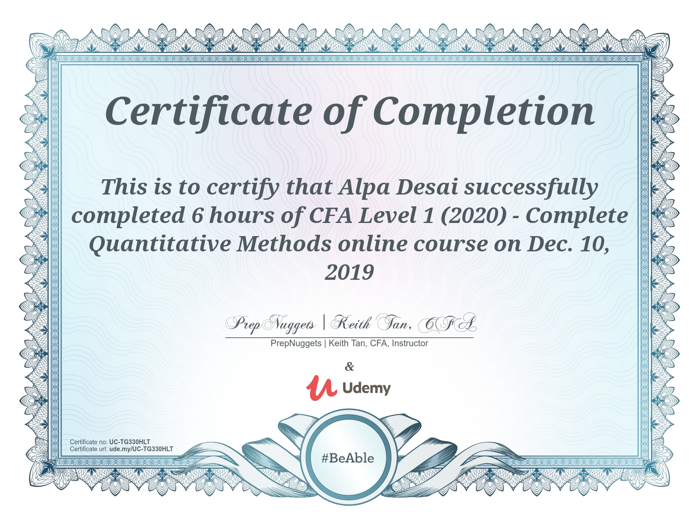

# Chartered Financial Analyst 2022 

The project provides an overview of the CFA exam 

Additional details reference https://github.com/alpaddesai/InvestmentBanking and https://github.com/alpaddesai/GraduateManagementAptitudeTest.
